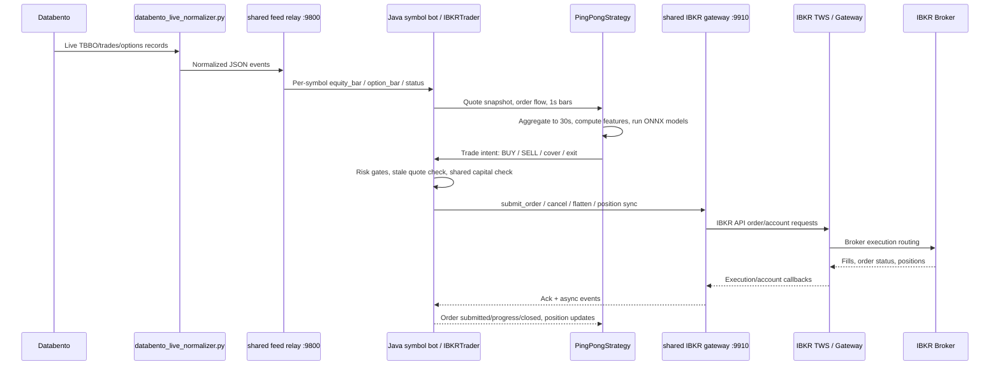

# Databento to IBKR Data Flow

This diagram shows the live data and execution flow for the Databento upgrade path in this worktree: Databento provides market data, Java symbol bots generate strategy decisions, and IBKR remains the broker/execution venue through either the shared Python gateway or an optional direct fallback.

## How to view the diagram

If this file looks like code, you are seeing the raw Mermaid source. Use one of these options:

1. Open the browser-rendered version: [`databento-ibkr-data-flow.html`](databento-ibkr-data-flow.html)
2. In JetBrains/IntelliJ, open this Markdown file and switch to the **Preview** or **Split** Markdown view.
3. From the repository root, run:

```bash
open docs/databento-ibkr-data-flow.html
```

## End-to-end architecture

```mermaid
flowchart LR
    %% External providers
    DB[(Databento Live Market Data)]
    TWS[IBKR TWS / IB Gateway<br/>local API endpoint]
    BROKER[(IBKR Broker / Exchange Routing)]

    %% Databento side
    subgraph DATABENTO_FEED["Databento market-data side"]
        NORM["scripts/databento_live_normalizer.py<br/>Databento Live client<br/>TBBO / trades / OPRA 1s bars"]
        RELAY["scripts/databento_shared_feed_relay.py<br/>shared feed relay<br/>default 127.0.0.1:9800"]
    end

    %% Per-symbol Java bots
    subgraph BOT_FLEET["Per-symbol Java bot fleet"]
        BOT["Spring Boot symbol bot<br/>IBKRTrader"]
        DBGW["DatabentoLiveGateway<br/>reads normalized JSON"]
        HEALTH["DatabentoFeedHealth<br/>freshness / silence / restart checks"]
        STRAT["PingPongStrategy actor<br/>1s bars -> 30s buckets<br/>features -> ONNX decisions"]
        RISK["IBKRTrader risk/order gate<br/>stale quote guard<br/>shared capital<br/>notional/share limits"]
        SGCLIENT["SharedIbkrGatewayClient<br/>newline-delimited JSON socket client"]
    end

    %% Shared execution side
    subgraph SHARED_IBKR["Shared IBKR execution side"]
        SGSERVER["SharedIbkrGatewayProtocolServer<br/>default 127.0.0.1:9910"]
        SGGW["SharedIBKRExecutionGateway<br/>symbol/order/request routing<br/>position & order sync"]
    end

    %% Market data flow
    DB -->|"live Databento records<br/>equities TBBO/trades + OPRA bars"| NORM
    NORM -->|"normalized newline JSON<br/>equity_bar / option_bar / status"| RELAY
    RELAY -->|"per-symbol JSON stream"| DBGW
    DBGW -->|"DatabentoEvent"| BOT
    BOT --> HEALTH
    BOT -->|"quote snapshot + order flow + source bars"| STRAT

    %% Strategy / order intent
    STRAT -->|"entry/exit intent"| RISK
    RISK -->|"submit_order / cancel_symbol_orders<br/>flatten_symbol / request_position_sync"| SGCLIENT

    %% Execution path
    SGCLIENT -->|"newline-delimited JSON commands"| SGSERVER
    SGSERVER --> SGGW
    SGGW -->|"one shared IBKR API connection"| TWS
    TWS --> BROKER

    %% Broker callbacks / reports
    BROKER -->|"fills / order status / positions"| TWS
    TWS -->|"IBKR callbacks / polling"| SGGW
    SGGW -->|"gateway events<br/>order_status / position_updated / error"| SGSERVER
    SGSERVER -->|"acks + async JSON events"| SGCLIENT
    SGCLIENT --> BOT
    BOT -->|"order progress / closed / position state"| STRAT

    %% Optional fallback
    RISK -. "fallback if shared gateway disabled/failed<br/>and direct IBKR socket is available" .-> TWS
```



## Runtime sequence



## Component map

| Layer | Main component(s) | Role |
|---|---|---|
| Databento ingestion | `scripts/databento_live_normalizer.py` | Connects to Databento and emits normalized JSON events such as `equity_bar`, `option_bar`, and `status`. |
| Shared Databento fanout | `scripts/databento_shared_feed_relay.py` | Runs one shared Databento stream/normalizer and fans events out to many Java symbol bots over TCP. |
| Java market-data adapter | `DatabentoLiveGateway` | Reads the shared relay or a private normalizer subprocess and converts JSON lines into `DatabentoEvent` objects. |
| Live bot orchestrator | `IBKRTrader` | One JVM per symbol. Owns feed health, strategy wiring, risk checks, broker routing, and position/order sync. |
| Strategy | `PingPongStrategy` | Actor-style strategy. Aggregates source bars, computes features/regime, runs ONNX models, and emits trade intents. |
| Shared execution client | `SharedIbkrGatewayClient` | Java-side client for the shared Python execution gateway. Uses newline-delimited JSON over TCP. |
| Shared execution gateway | `SharedIbkrGatewayProtocolServer` + `SharedIBKRExecutionGateway` | Centralizes one IBKR connection, submits orders, syncs positions/open orders, and broadcasts execution events. |
| Broker endpoint | IBKR TWS / IB Gateway | Local IBKR API bridge to Interactive Brokers. |

## Primary data paths

1. **Market data path**
   - Databento -> `databento_live_normalizer.py`
   - Normalizer -> `databento_shared_feed_relay.py`
   - Relay -> each bot's `DatabentoLiveGateway`
   - `IBKRTrader` -> `PingPongStrategy`

2. **Signal path**
   - `PingPongStrategy` aggregates 1-second source bars into 30-second buckets.
   - It computes technical/regime features and runs the configured ONNX models.
   - It emits entry/exit intents back to `IBKRTrader`.

3. **Order path**
   - `IBKRTrader` applies stale quote, position, shared-capital, notional, share-cap, and daily-order gates.
   - Preferred route: `SharedIbkrGatewayClient` -> Python shared gateway -> IBKR TWS/Gateway -> IBKR broker.
   - Optional fallback route: direct Java `EClientSocket.placeOrder(...)` -> IBKR TWS/Gateway.

4. **Execution feedback path**
   - IBKR returns fills, order statuses, positions, and errors to the shared gateway.
   - The gateway maps events back by symbol/order identifiers.
   - The Java bot updates `PingPongStrategy` with order progress, closed orders, and position state.


